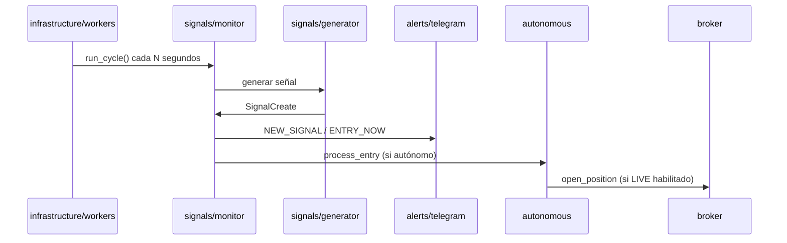

# Arquitectura del Sistema de Trading Semiautomático

## Visión general

Sistema de señales de trading con crecimiento compuesto controlado. Por defecto opera en **PAPER**; el modo **LIVE** requiere flags explícitos y validaciones.

El código está organizado **por feature** para que cada cambio quede aislado y sea seguro compartir el repo por git sin romper imports.

```
src/trading_bot/
├── core/              # Dominio compartido (enums, catálogo, excepciones)
├── config/            # Settings desde .env
├── db/                # SQLAlchemy async + modelos
├── schemas/           # DTOs Pydantic (API ↔ dominio)
├── infrastructure/    # Datos de mercado, workers, auditoría
├── features/          # Lógica de negocio por feature
│   ├── signals/       # Generación, monitor, estrategias, riesgo
│   ├── broker/        # Binance + execution engine
│   ├── autonomous/    # Trading autónomo con gate AI
│   ├── dashboard/     # API del dashboard
│   ├── alerts/        # Telegram
│   ├── ai/            # Analizador Ollama
│   ├── trades/        # Paper + trades manuales
│   ├── profiles/      # Perfiles de cuenta
│   ├── setup/         # Diagnóstico de configuración
│   └── backtest/      # Motor de backtest
├── api/               # Registro de routers (router.py + health)
├── static/            # dashboard.html
└── main.py            # FastAPI app
```

## Capas

```
┌─────────────────────────────────────────────────────────────┐
│  Presentación: dashboard.html + API REST (FastAPI)          │
│  Telegram (alerts)                                          │
└───────────────────────────┬─────────────────────────────────┘
                            │
┌───────────────────────────▼─────────────────────────────────┐
│  Features: signals, trades, broker, autonomous, ai, …       │
└───────────────────────────┬─────────────────────────────────┘
                            │
┌───────────────────────────▼─────────────────────────────────┐
│  Core + Schemas + DB                                        │
└───────────────────────────┬─────────────────────────────────┘
                            │
┌───────────────────────────▼─────────────────────────────────┐
│  Infrastructure: CCXT (market_data), workers, audit           │
└─────────────────────────────────────────────────────────────┘
```

## Features (dónde tocar cada cosa)

| Feature | Ruta | Responsabilidad |
|---------|------|-----------------|
| **signals** | `features/signals/` | Estrategias, generador, monitor de precios, riesgo, sizing |
| **broker** | `features/broker/` | `BinanceBroker`, `ExecutionEngine`, candados LIVE |
| **autonomous** | `features/autonomous/` | Ejecución automática al entrar + filtro AI |
| **dashboard** | `features/dashboard/` | `/api/v1/dashboard/*` |
| **alerts** | `features/alerts/` | `TelegramNotifier` |
| **ai** | `features/ai/` | Ollama, prompts, feedback |
| **trades** | `features/trades/` | Paper trading + entradas manuales |
| **profiles** | `features/profiles/` | Balance y perfiles de cuenta |
| **setup** | `features/setup/` | `/api/v1/setup/check`, test Telegram |
| **backtest** | `features/backtest/` | Backtest sobre estrategia MVP |

### Detalle `features/signals/`

```
signals/
├── generator.py          # Pipeline estrategia → riesgo → sizing
├── routes.py             # POST /signals/generate, GET /signals
├── monitor_routes.py     # Control del monitor (start/stop/status)
├── monitor/
│   ├── service.py        # Hub: escaneo, alertas, paper, autónomo
│   └── price_feed.py     # Precios en vivo (batch tickers)
├── strategies/
│   ├── trend_pullback_mvp.py
│   └── precious_metals_mvp.py
└── risk/
    ├── manager.py        # Límites diarios, RR, grado A/B/C
    └── sizer.py          # Tamaño, margen, apalancamiento
```

## Registro de routers

`main.py` monta routers desde `api/router.py`:

```python
from trading_bot.api.router import API_PREFIX, FEATURE_ROUTERS, health_router

app.include_router(health_router)
for feature_router in FEATURE_ROUTERS:
    app.include_router(feature_router, prefix=API_PREFIX)
```

Para añadir un endpoint nuevo: crea o edita `features/<nombre>/routes.py` y regístralo en `api/router.py`.

## Compatibilidad (shims)

Las rutas antiguas siguen funcionando para no romper código o tests externos:

| Ruta antigua | Shim → destino real |
|--------------|---------------------|
| `api/routes/signals.py` | `features/signals/routes.py` |
| `api/routes/dashboard.py` | `features/dashboard/routes.py` |
| `modules/signal_monitor/` | `features/signals/monitor/` |
| `modules/execution_engine/` | `features/broker/` |
| `workers/background.py` | `infrastructure/workers/background.py` |

**Convención:** código nuevo debe importar desde `features/` o `infrastructure/`, no desde `modules/`.

## Flujo principal



## Principios de diseño

| Principio | Implementación |
|-----------|----------------|
| Seguridad primero | Modo `PAPER` por defecto; `LIVE` bloqueado por feature flag |
| Riesgo antes que ganancia | `risk/manager` valida antes de `risk/sizer` |
| Un feature = un directorio | Cambios aislados; menos conflictos en git |
| Auditabilidad | `infrastructure/audit/logger` |
| Config por usuario | `.env` local, nunca en git |

## Monitoreo en background

`infrastructure/workers/background.py` arranca `SignalMonitorService` dentro de la API cuando `MONITOR_ENABLED=true`.

| Intervalo | Acción |
|-----------|--------|
| `scan_interval_seconds` (5 min) | Escanea watchlist y genera señales |
| `price_check_interval_seconds` (30 s) | Vigila entradas y dispara alertas |

## Arranque

```bash
./scripts/setup.sh
./scripts/run_api.sh          # API + monitor en background
./scripts/run_monitor.sh      # Solo monitor (sin API)
```

## Seguridad

- API keys en `.env` (nunca en código ni commits).
- `ExecutionEngine` con candados: `LIVE_MODE_ENABLED`, `BROKER_ENABLED`, `app_mode`.
- Cada usuario clona el repo y configura su propio `.env`.
