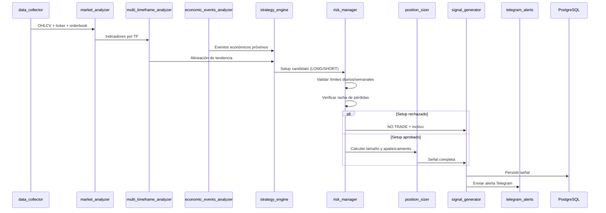
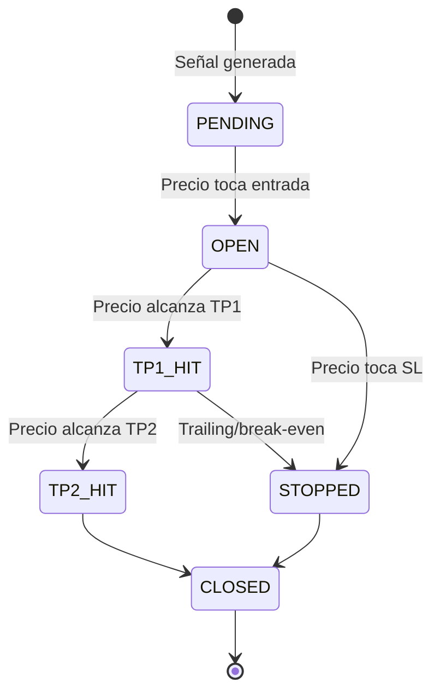

# Arquitectura del Sistema de Trading Semiautomático

## Visión general

Sistema de señales de trading con crecimiento compuesto controlado. **No ejecuta órdenes reales** hasta cumplir validaciones estrictas de backtesting y paper trading.

```
┌─────────────────────────────────────────────────────────────────────────────┐
│                              CAPA DE PRESENTACIÓN                           │
│  Dashboard (Next.js/Astro)  │  Telegram Bot  │  API REST (FastAPI)          │
└─────────────────────────────────────────────────────────────────────────────┘
                                        │
┌─────────────────────────────────────────────────────────────────────────────┐
│                              CAPA DE APLICACIÓN                           │
│  signal_generator │ paper_trading │ backtester │ execution_engine (LOCKED) │
└─────────────────────────────────────────────────────────────────────────────┘
                                        │
┌─────────────────────────────────────────────────────────────────────────────┐
│                              CAPA DE DOMINIO                              │
│  strategy_engine │ risk_manager │ position_sizer │ market_analyzer          │
│  multi_timeframe │ economic_events │ ai_chart_analyzer (opcional)         │
└─────────────────────────────────────────────────────────────────────────────┘
                                        │
┌─────────────────────────────────────────────────────────────────────────────┐
│                              CAPA DE DATOS                                │
│  data_collector (CCXT) │ PostgreSQL │ Redis │ audit_logger                  │
└─────────────────────────────────────────────────────────────────────────────┘
                                        │
┌─────────────────────────────────────────────────────────────────────────────┐
│                              CAPA DE TRABAJO ASÍNCRONO                    │
│  Celery workers: recolección OHLCV, análisis, generación de señales         │
└─────────────────────────────────────────────────────────────────────────────┘
```

## Principios de diseño

| Principio | Implementación |
|-----------|----------------|
| Seguridad primero | Modo `PAPER` por defecto; `LIVE` bloqueado por feature flag |
| Riesgo antes que ganancia | `risk_manager` valida antes de `position_sizer` |
| Probabilístico, no predictivo | Señales con confianza A/B/C y condiciones de invalidación |
| Auditabilidad | Toda decisión registrada en `audit_logs` |
| Separación de responsabilidades | Cada módulo tiene una interfaz clara |

## Flujo del sistema



### Ciclo de generación de señales (cada 5-15 min)

1. **Recolección**: `data_collector` obtiene velas multi-TF vía CCXT (Binance/Bybit).
2. **Análisis**: `market_analyzer` calcula EMA, RSI, ATR, volumen, S/R.
3. **Multi-TF**: `multi_timeframe_analyzer` evalúa alineación 1D → 4H → 1H → 15M.
4. **Eventos**: `economic_events_analyzer` consulta calendario económico (FOMC, CPI, NFP).
5. **Estrategia**: `strategy_engine` aplica reglas MVP (tendencia + pullback + confirmación).
6. **Riesgo**: `risk_manager` valida límites y clasifica setup A/B/C.
7. **Sizing**: `position_sizer` calcula posición, margen, apalancamiento, liquidación.
8. **Señal**: `signal_generator` ensambla y persiste la señal.
9. **Alerta**: `telegram_alerts` notifica al usuario.
10. **Paper**: Si hay señal operable, `paper_trading` simula la ejecución.

### Flujo de paper trading



### Bloqueo de modo LIVE

El `execution_engine` permanece deshabilitado hasta:

| Criterio | Umbral |
|----------|--------|
| Backtest positivo | Profit factor > 1.3, max DD < 15% |
| Paper trading | ≥ 100 operaciones cerradas |
| Profit factor paper | > 1.3 |
| Racha máxima pérdidas | ≤ 5 consecutivas |
| Drawdown paper | < 10% |
| Confirmación manual | `LIVE_MODE_ENABLED=true` + flag en DB |

## Estrategia MVP inicial

**Nombre**: `TrendPullbackMVP`

**Activos**: BTC/USDT, ETH/USDT (alta liquidez, datos abundantes)

**Temporalidades**: 4H (tendencia), 1H (entrada), 15M (timing)

### Reglas LONG

1. Precio > EMA200 en 4H (tendencia alcista).
2. EMA20 > EMA50 en 1H (momentum).
3. RSI(14) en 1H entre 40-60 (no sobrecomprado).
4. Pullback a zona EMA20/50 en 1H con rechazo (vela alcista).
5. Volumen en 15M > media 20 periodos.
6. ATR(14) en rango normal (no > 2x media 30 días).
7. Sin evento económico alto impacto en ±2 horas.
8. Stop loss: bajo mínimo del pullback o 1.5× ATR.
9. TP1: 1× riesgo (R:R 1:1 parcial).
10. TP2: 2× riesgo (R:R 1:2 mínimo).

### Reglas SHORT

Espejo de LONG con condiciones invertidas.

### Clasificación de setup

| Grado | Condiciones extra | Riesgo máx |
|-------|-------------------|------------|
| A | 4H + 1H + 15M alineados, volumen fuerte, sin noticias | 1.0% (1.5% manual) |
| B | 2 de 3 TF alineados, confirmación parcial | 0.5% |
| C | Cualquier fallo en reglas obligatorias | NO TRADE |

## Módulos

### risk_manager

- Valida límites diarios (2%), semanales (5%).
- Bloquea tras 2 pérdidas consecutivas.
- Rechaza R:R < 1:2.
- Rechaza sin stop loss claro.
- Asigna grado A/B/C y % de riesgo permitido.

### position_sizer

- Calcula `position_size`, `margin`, `leverage` dinámico.
- Factores: volatilidad (ATR), distancia al SL, TF, grado setup, drawdown.
- Estima liquidación aproximada.
- Nunca recomienda martingala ni aumento de leverage por pérdidas.

### backtester

- Motor con `backtesting.py` o `vectorbt`.
- Simula comisiones (0.04%), slippage (0.02%), apalancamiento.
- Genera métricas: winrate, PF, Sharpe, max DD, expectancy.

### paper_trading

- Simula ejecución sobre precios en tiempo real.
- Registra P&L, actualiza balance virtual.
- Alimenta métricas para desbloqueo de LIVE.

### execution_engine (BLOQUEADO)

- Interfaz preparada pero `raise LiveModeBlockedError` siempre.
- Solo se activa tras validaciones + confirmación manual.

## Monitoreo y alertas en tiempo real

El `SignalMonitorService` corre en background dentro de la API:

| Intervalo | Acción |
|-----------|--------|
| Cada 5 min (`scan_interval_seconds`) | Escanea BTC/USDT, ETH/USDT y genera señales operables |
| Cada 30 s (`price_check_interval_seconds`) | Vigila señales WATCHING/ACTIVE y precios en vivo |

### Tipos de alerta Telegram

| Alerta | Cuándo | Urgencia |
|--------|--------|----------|
| `NEW_SIGNAL` | Se detecta setup operable | Normal |
| `ENTRY_APPROACHING` | Precio a <0.5% de la entrada | Alta (notificación) |
| `ENTRY_NOW` | Precio tocó la entrada | **Máxima — ENTRA AHORA** |
| `PAPER_OPENED` | Paper trade abierto automáticamente | Normal |
| `TAKE_PROFIT` / `STOP_LOSS` | Cierre de operación paper | Alta |

### Flujo para no perder entradas

```
Estrategia detecta setup → Telegram NEW_SIGNAL → status WATCHING
Precio se acerca       → Telegram ENTRY_APPROACHING
Precio toca entrada    → Telegram ENTRY_NOW + paper trade automático
```

## Stack y despliegue

```
./scripts/setup.sh
./scripts/run_api.sh          # API + monitor en background
./scripts/run_monitor.sh      # Solo monitor (sin API)
docker compose up -d          # PostgreSQL + Redis (opcional)
```

## Seguridad

- API keys en `.env` (nunca en código).
- `execution_engine` con doble candado: env var + registro DB.
- Logs auditables con timestamp, módulo, decisión y contexto.
- Rate limiting en API pública.
